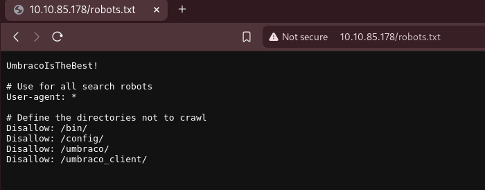

# Anthem

[Enlace a la máquina](https://tryhackme.com/room/anthem)

## Enumeration

En el escaneo aparece información sobre los puertos TCP :

- 80 : Microsoft HTTPAPI hhttd 2.0
- 3389 : Microsoft Terminal Services (RDP)

Entramos por el puerto 80 en el navegador y nos encontramos un blog donde vemos un post escrito por el usuario del blog "Jane Doe". También aparece un correo de contacto y nos dicen que posiblemente el usuario de la máquina pueda tener uno con la misma estructura.

Buscando en el robots.txt aparece un texto al principio que parece relevante.

En el blog encontramos otro post con lo que parece un poema incompleto en inglés.

Buscando en wikipedia encontramos el poema completo en el cual se menciona en el último verso que faltaba el nombre del poema "Solomon Grundy". Si atendemos a lo anterior la abreviación de Solomon Grundy es SG, lo cual encaja con el formato mencionado.

## Gain Access

Como hemos visto anteriormente, el puerto 3389 está abierto así que podemos conectarnos por RDP.

Probamos con el usuario SG y el texto del robots.txt y conseguimos entrar en la máquina.

## Escalate

Examinamos el disco en busca de alguna pista y en una de las carpetas ocultas encontramos lo que parece un archivo de restauración en txt.

Intentamos entrar pero no tenemos permisos, tendremos que intentar modificarlos.

Parece una contraseña, vamos a intentar probar a entrar a la Powershell como administrador.

Efectivamente, era la contraseña de administrador.

