# Library

[Enlace a la máquina](https://tryhackme.com/room/bsidesgtlibrary)

## Escaneo con Nmap

En el escaneo aparece información sobre los puertos TCP :

- 22 : OpenSSH 7.2p2
- 80 : Apache httpd 2.4.18

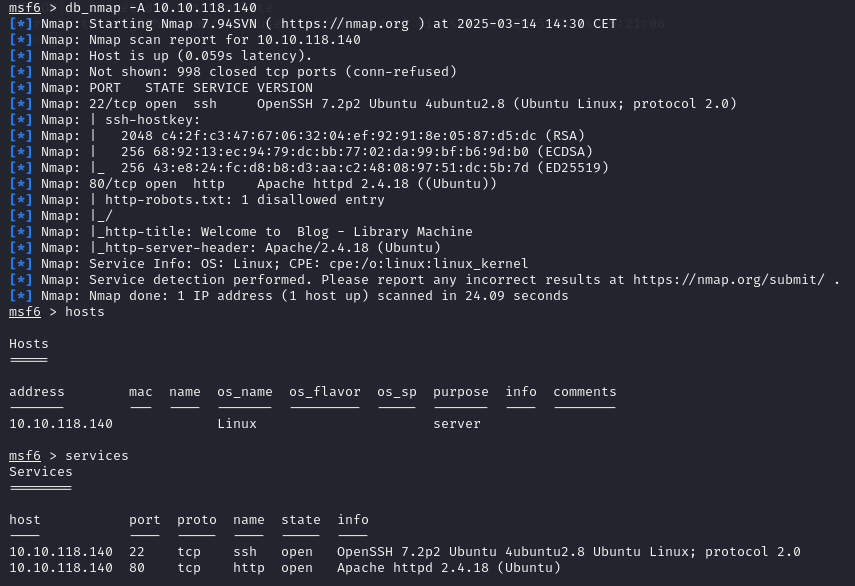

Entramos por el puerto 80 en el navegador y nos encontramos un blog. Donde vemos un post escrito por el usuario del blog "meliodas".

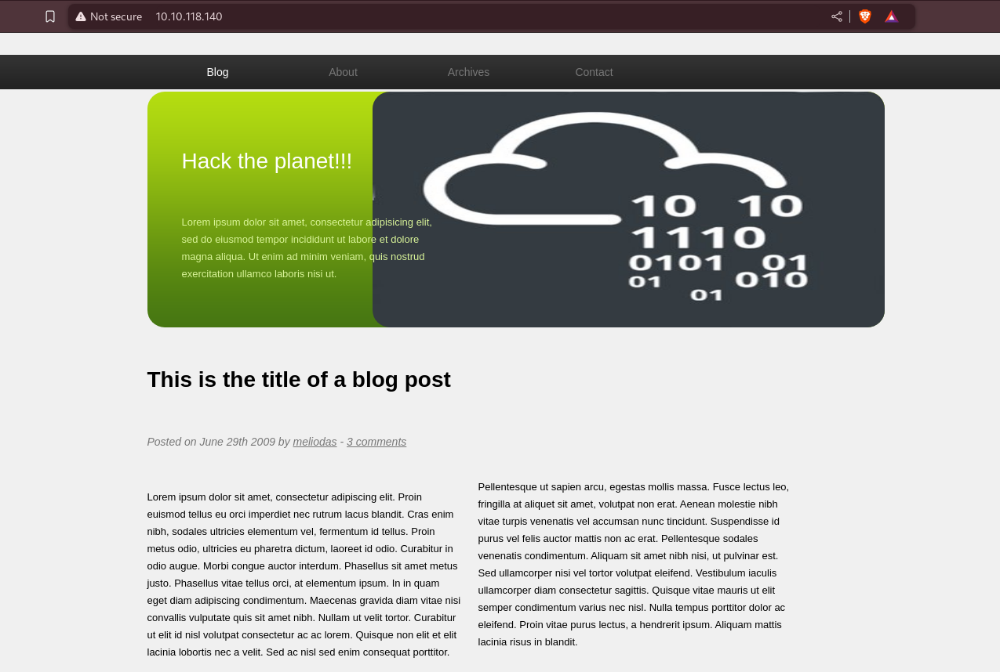

## Identificación de la vulnerabilidad

Buscando posibles vulnerabilidades en los servicios encontrados encontramos [una vulnerabilidad](https://www.cvedetails.com/cve/CVE-2016-6210/) con un exploit publicado.

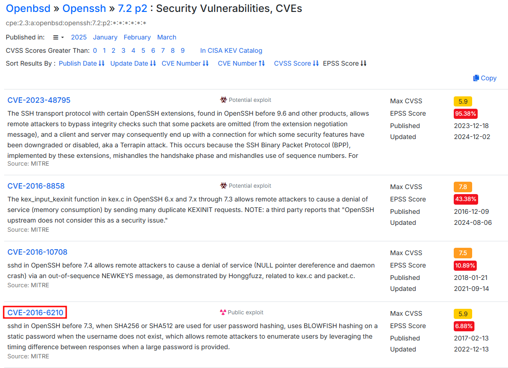

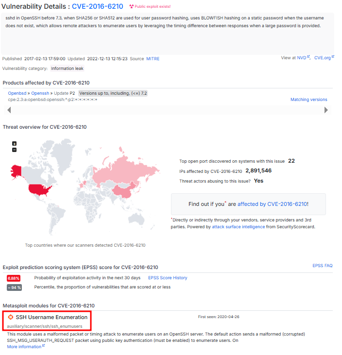

## Explotación de la vulnerabilidad

### Gain Access

Procedemos a explotar la vulnerabilidad, para ello buscamos en metasploit por el CVE de dicha vulnerabilidad.

Este exploit verifica si los usuarios introducidos en la lista existen en el servicio SSH. Vamos a probar con el usuario que encontramos antes en el blog.

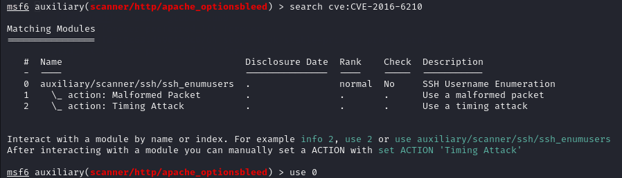

Abrimos las opciones e introducimos los datos necesarios.

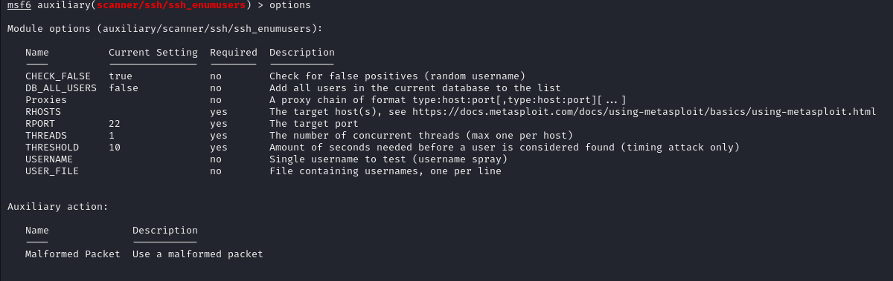

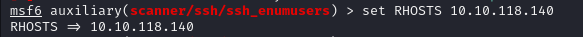

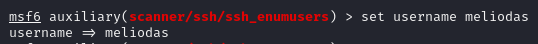

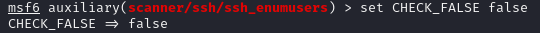

Ejecutamos el exploit y observamos que el usuario "meliodas" existe.

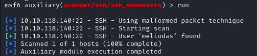

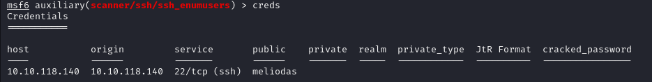

Utilizamos la herramienta "hydra" para atacar con fuerza bruta al servicio SSH con dicho usuario y el diccionario de contraseñas [*rockyou.txt*](https://github.com/brannondorsey/naive-hashcat/releases).

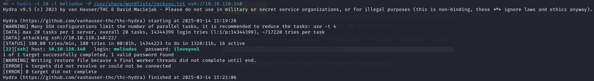

Obtenemos la contraseña, así que podemos entrar por SSH con : 

- usuario : meliodas
- contraseña : iloveyou1

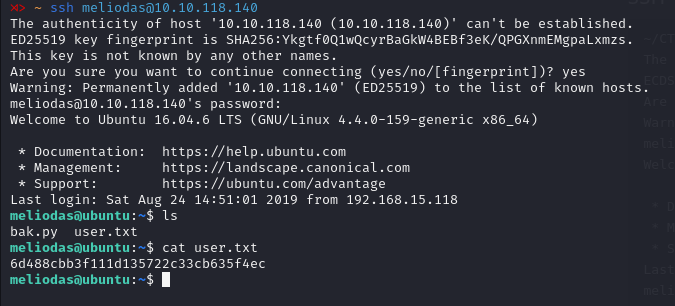