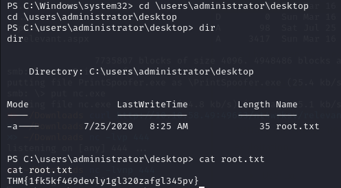

# Relevant

[Enlace a la máquina](https://tryhackme.com/room/relevant)

## Enumeration

En el escaneo aparece información sobre los puertos TCP :

- 80: Microsoft Internet Information Services (IIS) httpd 10.0
- 135
- 139
- 445 : Microsoft DS (SMB)
- 3389
- 49663
- 49667
- 49668

## Gain Access

Probamos a listar las unidades compartidas de SMB

Tenemos una red de disco que parece sospechosa. Vamos a intentar entrar.

Ni siquiera tiene contraseña así que ya tenemos acceso, así que tenemos abierta la posibilidad de subirle algún tipo exploit que nos ayude a entrar en el sistema. 

La forma más sencilla de obtener acceso podría ser una "shell reversa", así que vamos a generar un exploit con msfvenom que nos ayude a ese cometido.

Cargamos el exploit

Ponemos en escucha un netcat en el puerto que hayamos indicado en el exploit.

Hacemos una petición curl a la dirección del ejecutable

Ya tendríamos nuestra shell reversa con acceso al usuario del sistema.

## Escalate

Observando los privilegios del usuario vemos que tiene habilitado "SeImpersonatePrivilege" que permite impersonar un usuario una vez estás dentro del sistema. 

Pero no están facil como abrir la shell como administrador, así quenecesitamos otro vector de ataque. 

Existe una vulnerabilidad en el servicio de Print Spoofer, vamos a probar por ahí.

Cargamos el [ejecutable de Print Spoofer](https://github.com/dievus/printspoofer) por SMB.

Ejecutamos el archivo de forma que nos abra una powershell como administrador.

