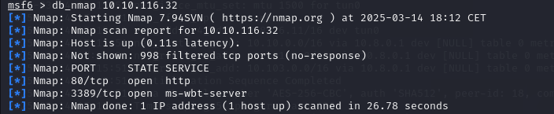
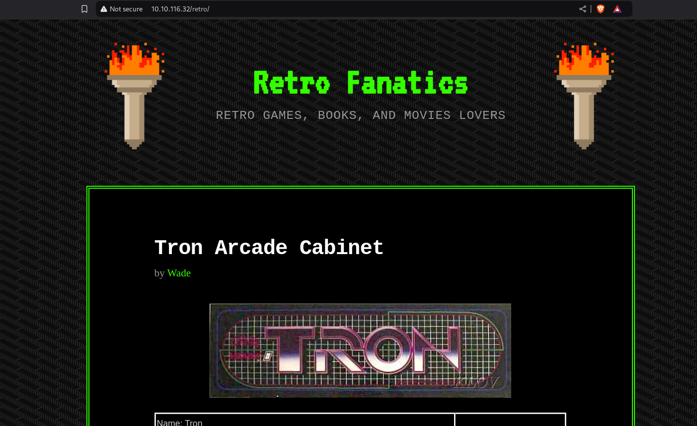

# Retro

[Enlace a la máquina](https://tryhackme.com/room/retro)

## Enumeration

En el escaneo aparece información sobre los puertos TCP :

- 80 : Microsoft IIS (Internet Information Service) 10.0
- 3389 : Microsoft Terminal Services (RDP)

Realizamos un fuzzing de directorio al servidor Web alojado en el puerto 80

Encontramos el path a una posible página principal

Efectivamente, es la página principal de la web. Encontramos un usuario que está posteando en el blog, podría ayudarnos más adelante.

En uno de los post una nota dejada por dicho usuario para no olvidarla, también podría sernos de utilidad.

## Explotación de la vulnerabilidad

### Gain Access

Con las credenciales encontradas entramos por RDP al ordenador

### Escalate

Para escalar privilegios haremos uso de un exploit que explota la vulnerabilidad CVE-2017-0213

Descomprimimos el archivo

Levantamos en un servidor http con el modelo de python http.server

Descargamos el archivo

Lo ejecutamos y ya tendremos acceso como administrador

