# Tech Support

[Enlace a la máquina](https://tryhackme.com/room/techsupp0rt1)

## Enumeration

En el escaneo con NMAP aparece información sobre los puertos TCP :

- 22 : OpenSSH 7.2p2
- 80 : Apache hhttpd 2.4.18
- 139
- 445 : Microsoft DS (SMB)

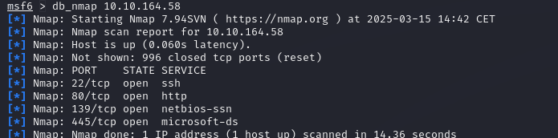

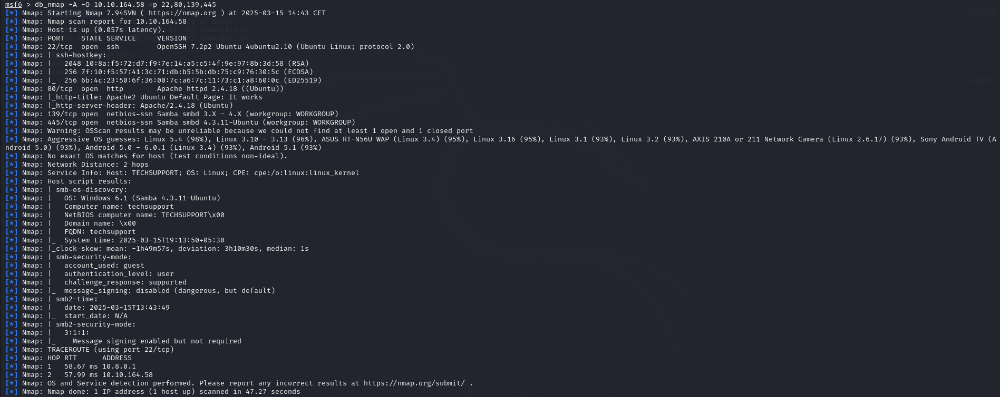

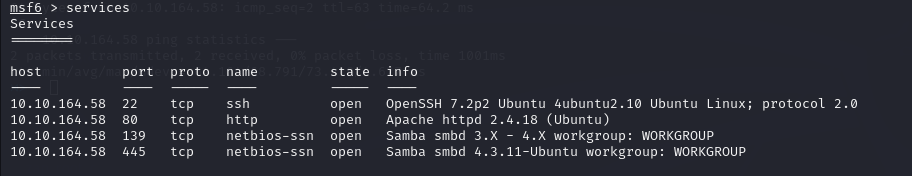

Usamos para ver las unidades SMB compartidas

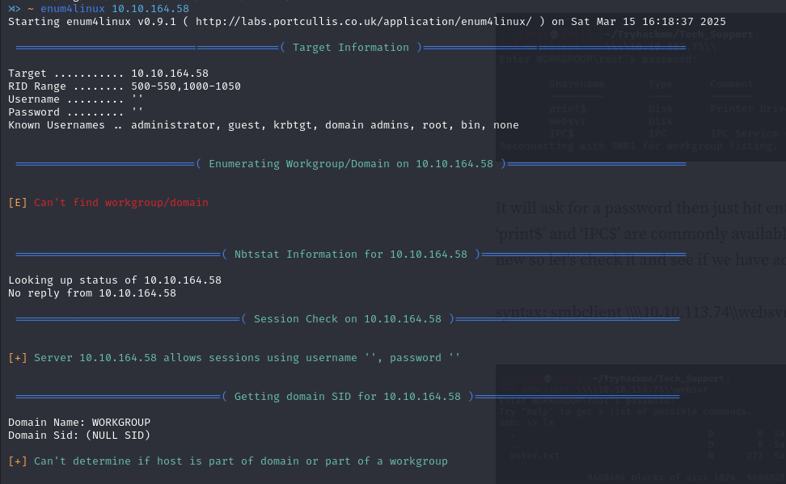

Vemos una unidad sospechosa llamada "websvr"

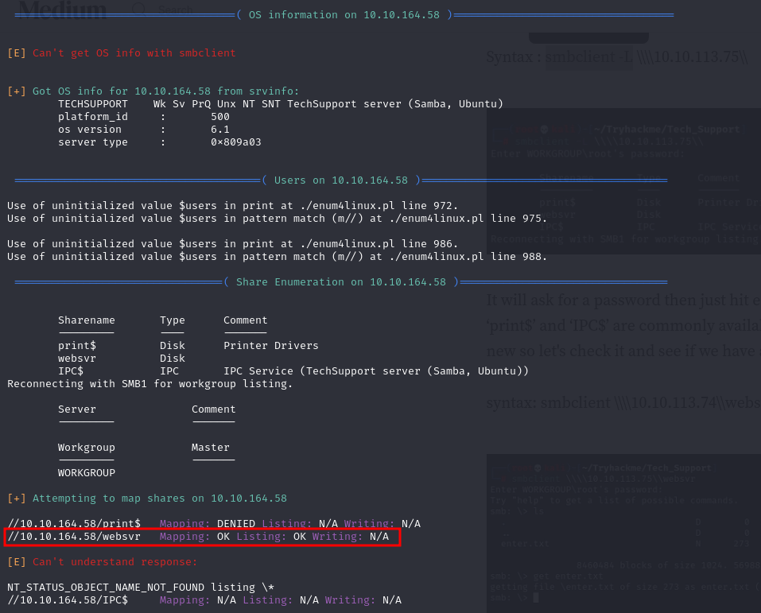

Entramos en la unidad

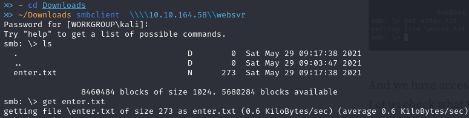

Encontramos credenciales de acceso

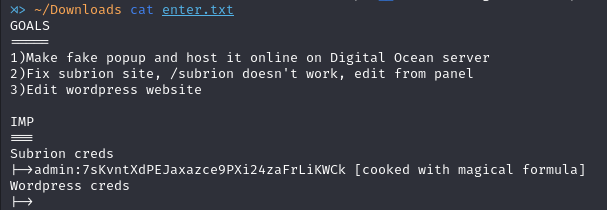

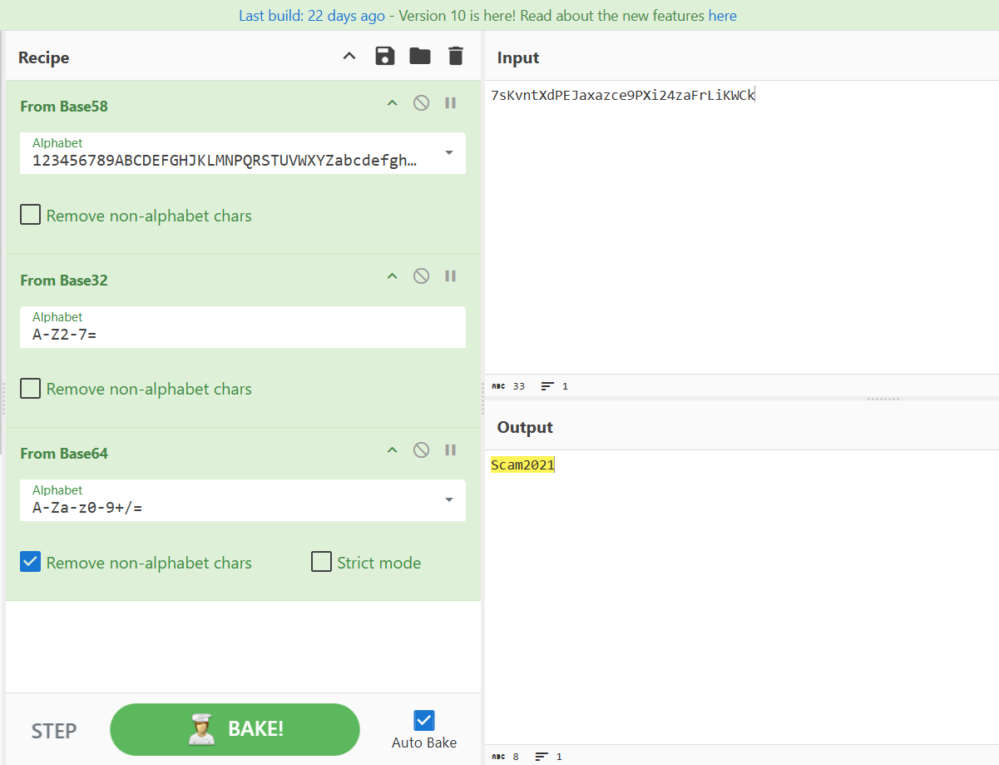

En el puerto 80, encontramos el login del CMS Subrion. Entramos las credenciales.

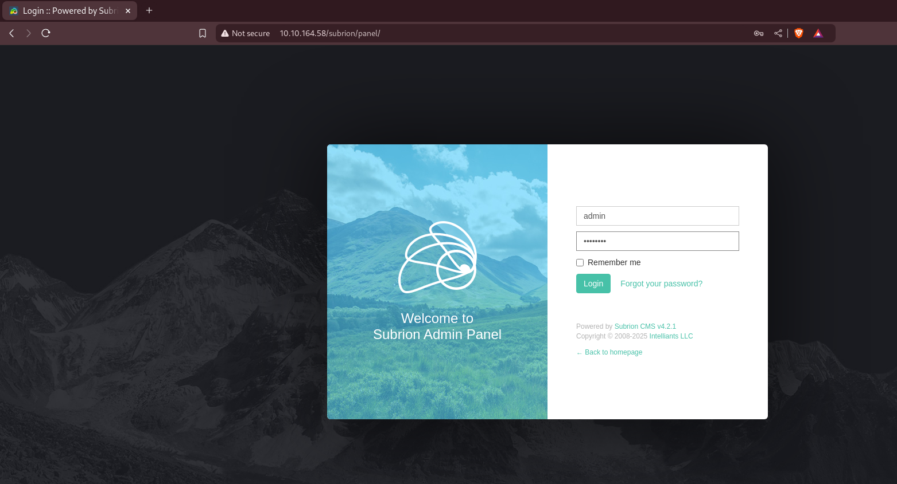

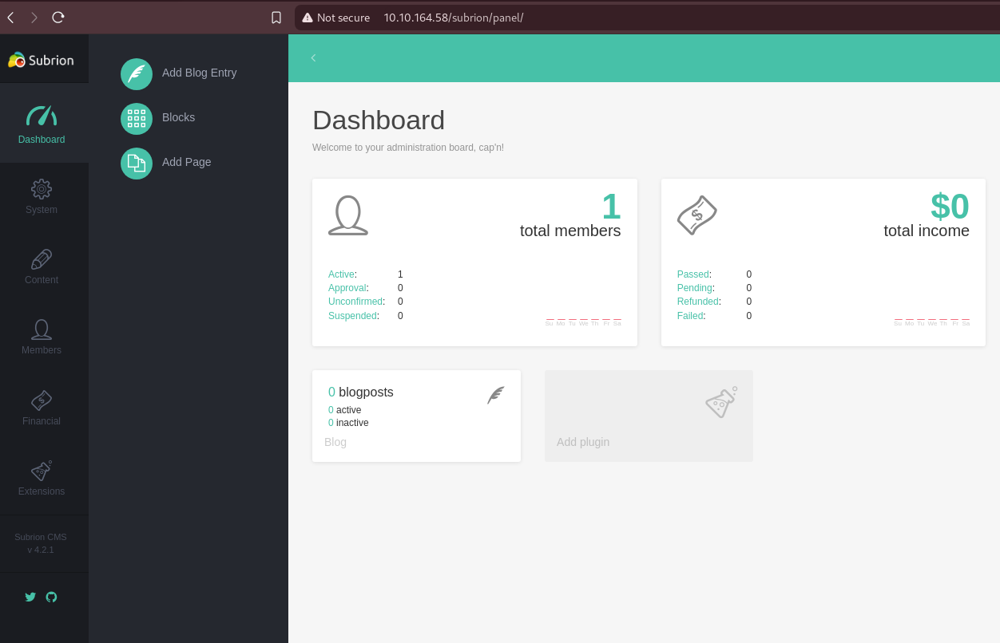

Buscamos en Metasploit algún exploit para esa versión de Subrion y encontramos uno que explota una vulnerabilidad relacionada con la subida de archivos.

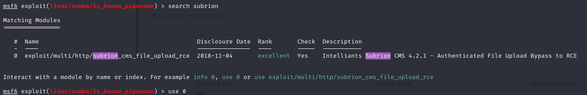

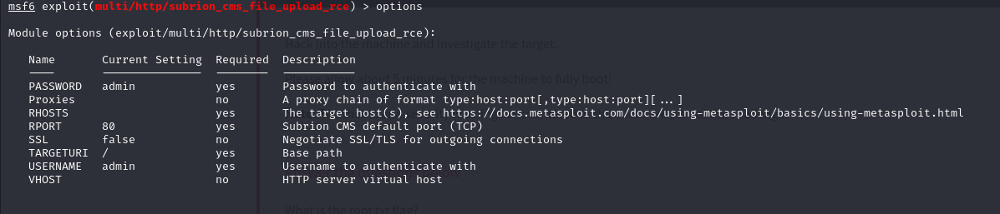

Introducimos los datos 

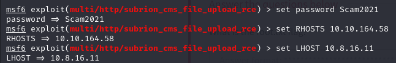

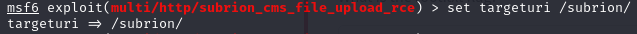

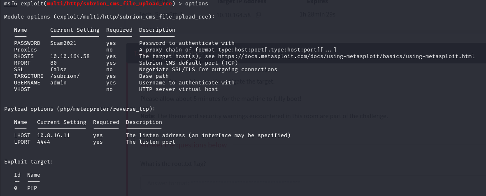

Y ejecutamos

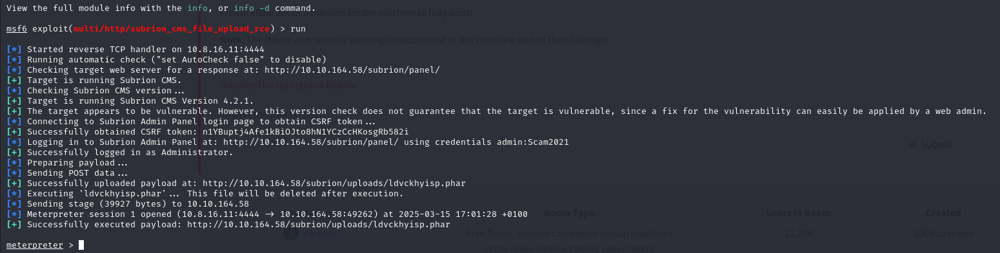

Tenemos acceso a una shell de meterpreter

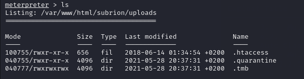

Ejecutamos una shell de bash dentro de la sesión y hacemos un upgrade de dicha shell usando python

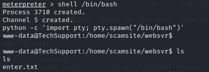

Buscando por la unidad encontramos la configuración de wordpress con una contraseña de acceso a la base de datos.

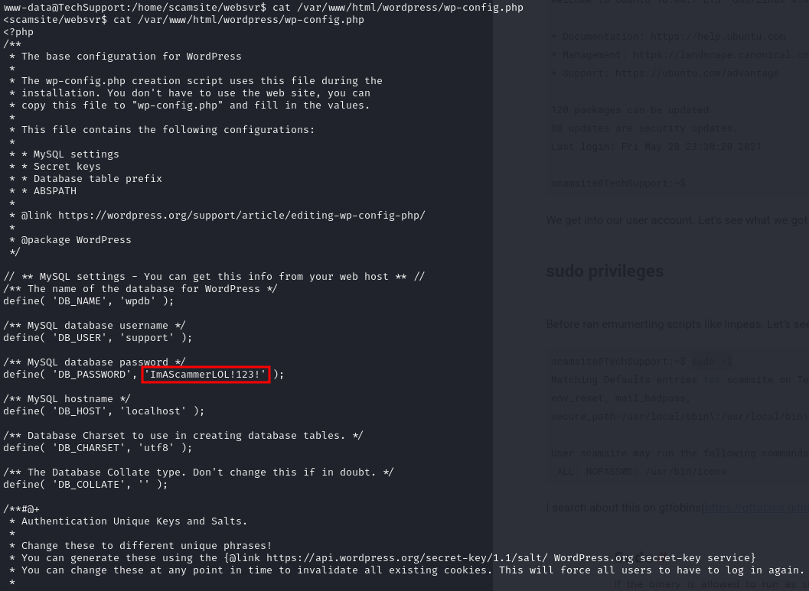

Intentamos abrir una ventana de ssh con las credenciales encontradas.

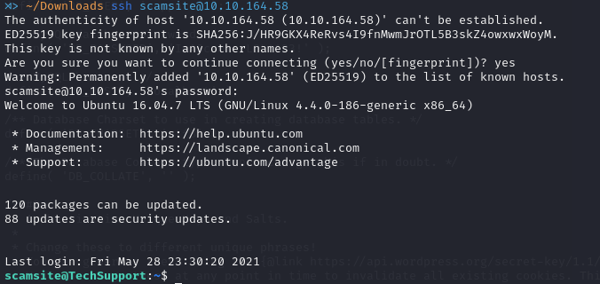

## Escalate

Vemos los comandos que puede correr sin necesidad de tener acceso como root.

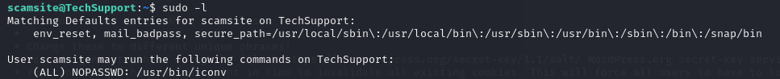

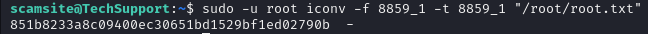

